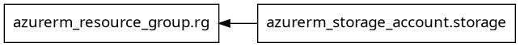

# 🔗 Dependency Graph

## ✅ What Is It?
The dependency graph is Terraform’s internal map of what needs to be created/updated before or after something else — based on how your resources and modules reference each other.

It allows Terraform to:
- Parallelize resource creation when safe
- Ensure correct order of operations
- Handle destroy/replace scenarios gracefully

## 🧰 What It's Used For
- Avoiding race conditions and broken deployments
- Ensuring that dependent resources (like VMs needing a subnet) are created in the right order
- Understanding the relationships in complex infrastructures

## 🔎 How It Works
Terraform automatically infers resource dependencies when:
- You reference outputs or attributes from one resource in another.
- You explicitly set dependencies using `depends_on`.

## 🧪 Example: Implicit Dependency
```hcl
resource "azurerm_resource_group" "rg" {
  name     = "demo-rg"
  location = "East US"
}

resource "azurerm_storage_account" "storage" {
  name                     = "demostore123"
  resource_group_name      = azurerm_resource_group.rg.name
  location                 = azurerm_resource_group.rg.location
  account_tier             = "Standard"
  account_replication_type = "LRS"
}
```
Here, Terraform automatically creates the resource group before the storage account because you used:
```hcl
resource_group_name = azurerm_resource_group.rg.name
```

## 🔧 Example: Explicit Dependency Using `depends_on`
Sometimes, you have resources that don’t reference each other directly, but they logically depend on one another.
```hcl
resource "null_resource" "config_script" {
  depends_on = [azurerm_virtual_machine.vm]

  provisioner "local-exec" {
    command = "echo Configuring VM..."
  }
}
```
Even though `null_resource` isn’t using the VM directly, the `depends_on` ensures the VM is fully created before running this script.

## 📈 How to Visualize the Dependency Graph
**Step 1:** Install Graphviz
```bash
sudo apt install graphviz
```
**Step 2:** Generate Dependency Graph
```bash
terraform graph | dot -Tpng > graph.png
```
Now open `graph.png` to see a visual DAG (Directed Acyclic Graph).


🎯 **Pro tip:** Nodes starting with `module.` show module-level dependencies.

## 🧠 Best Practices
| Practice                              | Reason                                 |
|----------------------------------------|----------------------------------------|
| Use attribute references (implicit deps)| Makes config cleaner and clearer       |
| Use depends_on only when necessary     | Avoids over-constraining execution     |
| Visualize graphs for large infra       | Debug creation/destroy order           |

## ⚠️ Common Pitfalls
- Overusing `depends_on` can limit parallelism
- Missing dependencies can cause race conditions (e.g., using DNS zones before creation)
- Deleting a resource might break implicit chains and lead to partial destroys

## ✅ Summary
| Concept               | Description                                 |
|-----------------------|---------------------------------------------|
| Implicit dependencies | Created automatically via attribute references|
| Explicit dependencies | Created via depends_on                      |
| Graph visualization   | `terraform graph | dot -Tpng`               |
| Purpose               | Control execution order & parallelism        |
